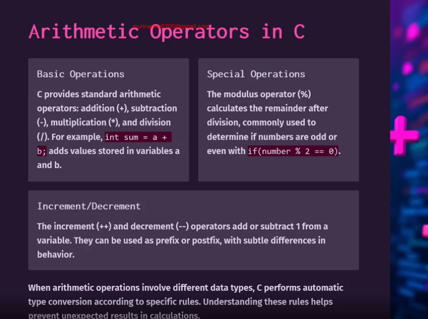
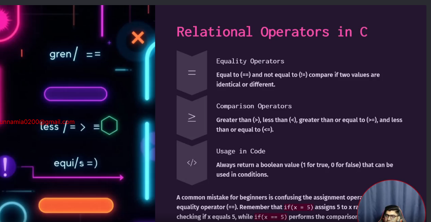
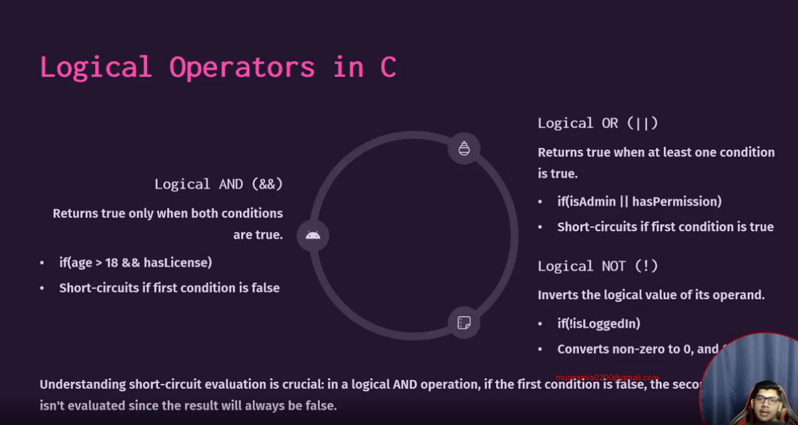
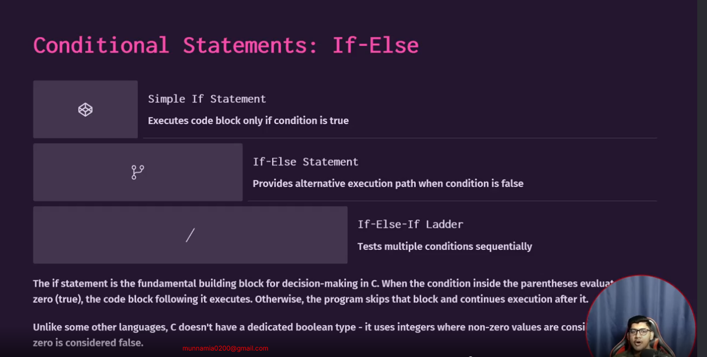
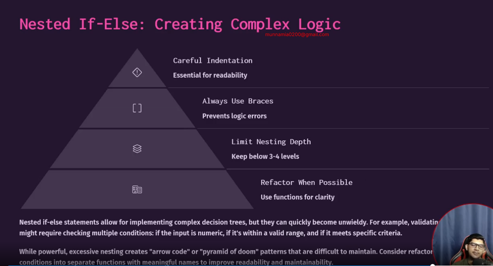

# M-2 OPERATORS CONDITIONAL STATEMENT

### what is operators 

- An operator is a symbol or keyword that tells the computer what operation it should perform on values or variables.

In the example below, the + operator is used to add the numbers 10 and 5 together
## 2-1 Arithmetic Operators






```c
#include<stdio.h>
int main()
{
    int a =15;
    int b= 2;
    int sum = a+b;
    printf("summation = %d\n",sum);
    int sub = a - b;
    printf("subtraction = %d\n",sub);
    int mul = a*b;
    printf("multiplication= %d\n",mul);
    int div = a/b;
    printf("division = %d",div);
    // division = 7 output should 7.5 but why 7 because when c compiler see a = 15 and b=2 both integer type then he get output 7 integer solution is minimum 1 type need convert to float then solved
    //   float div = a/b;
    // printf("division = %f",div);

  return 0;
}
```